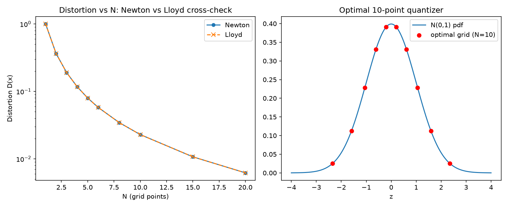

# rmq-localvol
Recursive marginal quantization for derivatives pricing, extended to numerically-calibrated local volatility surfaces

## M1 — Quantization Primitive

Optimal scalar quantization of the standard Gaussian via Newton's method,
cross-validated against an independent Lloyd's-algorithm implementation.

